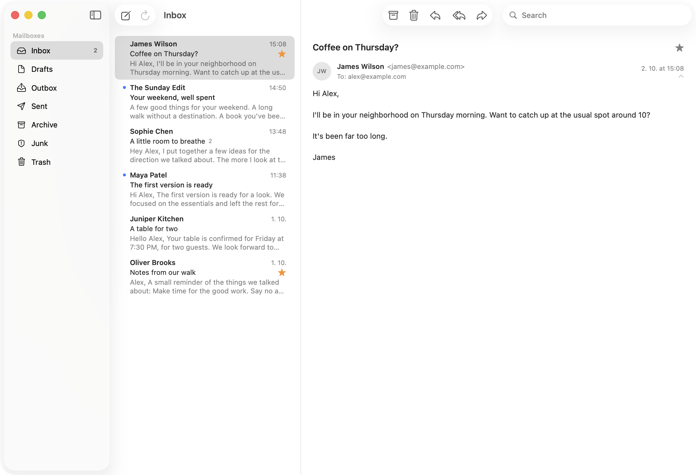

# Postie

A small native Gmail client for macOS, built with SwiftUI.

Postie is for people who want a simple Mac email client without Electron,
subscriptions, AI features, or workspace bloat.

## Features

- Native SwiftUI macOS app
- Gmail integration using Google sign-in and the Gmail API
- Multiple Gmail accounts, merged into one set of folders. Replies, forwards and
  archive/trash actions always go through the account the conversation belongs to
  and the default account for new messages can be chosen in Settings
- Inbox, Drafts, Sent, Archive, Junk, and Trash
- Conversation view with HTML email rendering
- Compose, reply, reply all, and forward in a rich-text editor (bold, italic,
  underline, lists, links), with attachments and your Gmail signature
- Drafts are saved in Gmail, so they show up in every Gmail client: closing a
  message you have written asks whether to keep it, and drafts can be edited
  later from the Drafts folder
- Archive, trash, star, and read/unread actions
- Search as you type across all accounts, powered by Gmail: search the current
  folder or All Mail, with Gmail operators such as `from:` and `has:attachment`.
  Results are not stored in the local cache
- Reading attachments: shown in the message header and as a chip in the list;
  double-click to open, or use the context menu to save, share, or copy
- Local SQLite cache for previously loaded mail
- Incremental Gmail synchronization while the app is running
- Native light and dark mode
- Dock badge for unread Inbox mail

## Status

Postie is an early project that I built primarily as the Gmail client I wanted
to use myself.

It supports Gmail accounts only and is not intended to replace
every feature of Gmail or become a generic IMAP client.

Planned:

- Search suggestions (people and subjects)
- Showing CID (embedded) images
- Gmail labels
- Full offline mailbox downloads

Not planned:

- Generic IMAP / Exchange support
- Push notifications while Postie is closed

## Privacy and permissions

Postie talks to Gmail directly from your Mac. There is no Postie server.

It asks for these Google permissions:

- `gmail.modify` to read mail, to archive, trash, star, and mark mail as read
  or unread, and to save and delete your drafts
- `gmail.send` to send mail
- `gmail.settings.basic` to read your signature, so new messages can include it.
  Postie never changes your Gmail settings
- `contacts.readonly` and `contacts.other.readonly` to read your Google contacts
  and the people you have written to, so the composer can suggest addresses.
  Postie never changes your contacts

Postie never permanently deletes mail. Trash is Gmail's normal, recoverable
Trash. Sign-in credentials stay in your Mac's Keychain,
and loaded mail and your contacts are cached in a local SQLite database on your Mac.

The Gmail ones are restricted scopes and Postie has not been verified
by Google, so the sign-in screen shows "Google hasn't verified this app". Choose
**Advanced > Go to Postie (unsafe)**, then tick all the permissions on the
next screen. Postie needs all of them to work. Unverified apps are limited to 100
users. If you fork Postie, create your own OAuth client in Google Cloud and put
it in `Configuration/Google.local.xcconfig` (see the `.example` file).

More details are in the [privacy policy](https://postie.kulman.sk/privacy).

## Download

Download `Postie.zip` from the
[latest release](https://github.com/igorkulman/Postie/releases/latest), unzip it
and drag Postie to your Applications folder. The app is signed with a Developer ID
and notarized by Apple. See [CHANGELOG.md](CHANGELOG.md) for what changed.

## Requirements

- macOS 26
- Xcode 27 (only to build it yourself)

## Running Postie from source

Open `Postie.xcodeproj`, choose the **Postie** scheme and **My Mac**, and run.

## Selection regression without a mailbox

In a Debug build, launch with `-PostieSelectionRegression` to run the real Gmail list/detail UI
against deterministic mail and an in-memory SQLite cache. It uses no real
credentials, network requests, or saved mailbox database.

1. Open **Thread to open**.
2. Choose **Regression > Insert Newer Mail**. The highlight and detail must stay
   on the same conversation, even though its row moved.
3. Archive it with **⌃⌘A**. **Next older thread** must become selected and open.
   Use the arrow keys immediately to check that keyboard focus is in the list.
4. Archive the remaining threads until the inbox is empty. Both selection and
   detail must clear, Archive/Trash must be disabled, and the empty list must
   retain keyboard focus. Inserting mail again must not automatically open it.

The Regression menu also simulates an external archive of **Thread to open**
and a rejected next archive/trash. External disappearance clears selection
without opening unrelated mail; rejection preserves the selected thread.

The policy is identity-based: an explicit removal
chooses the next surviving older neighbor from the visible order at action time,
then the nearest surviving newer neighbor, then no selection. Reordering never
changes a surviving selection. Removing an unselected thread or completing an
operation after the user changes selection does not choose a new thread.

## Tests

Run the **Postie** scheme's tests (⌘U). They use fixtures and need neither a
Google account nor network access.
